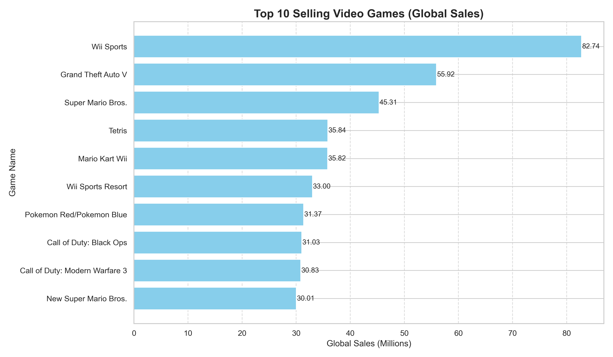
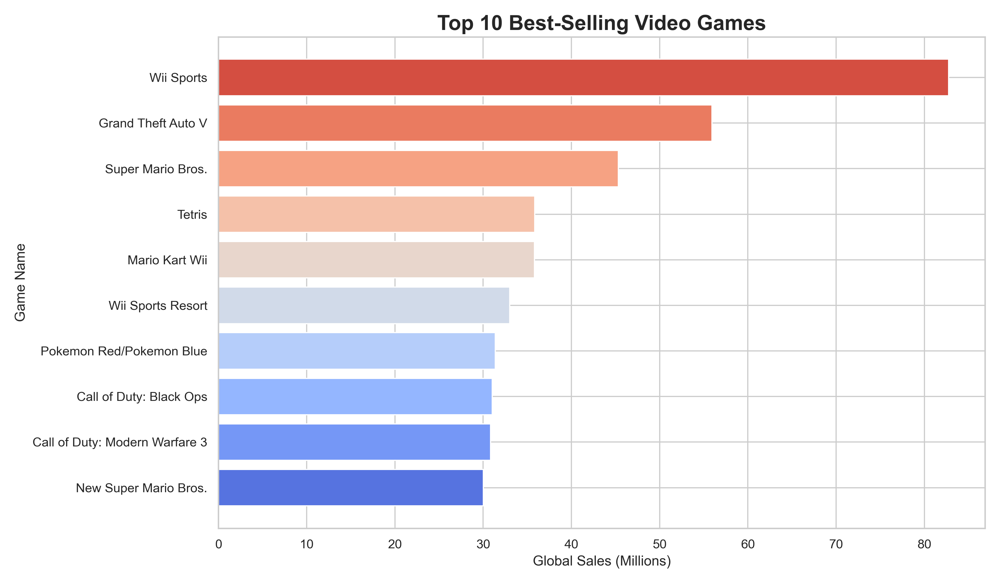
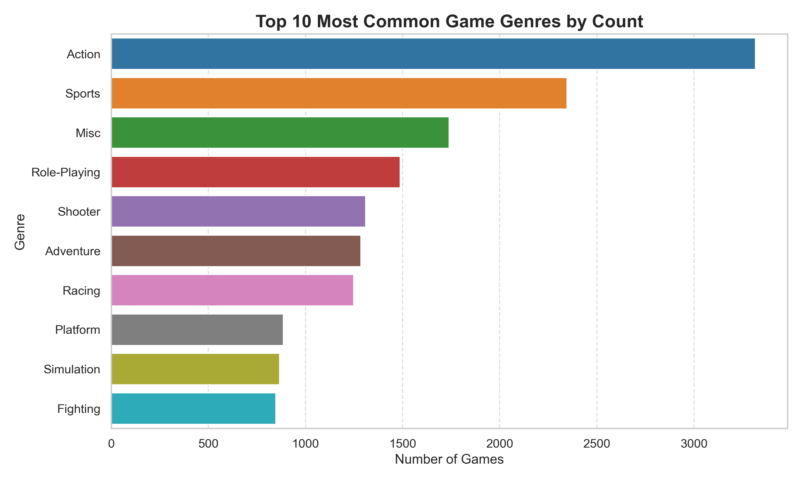
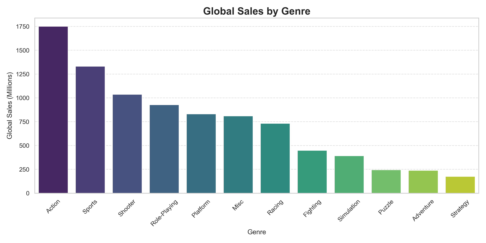
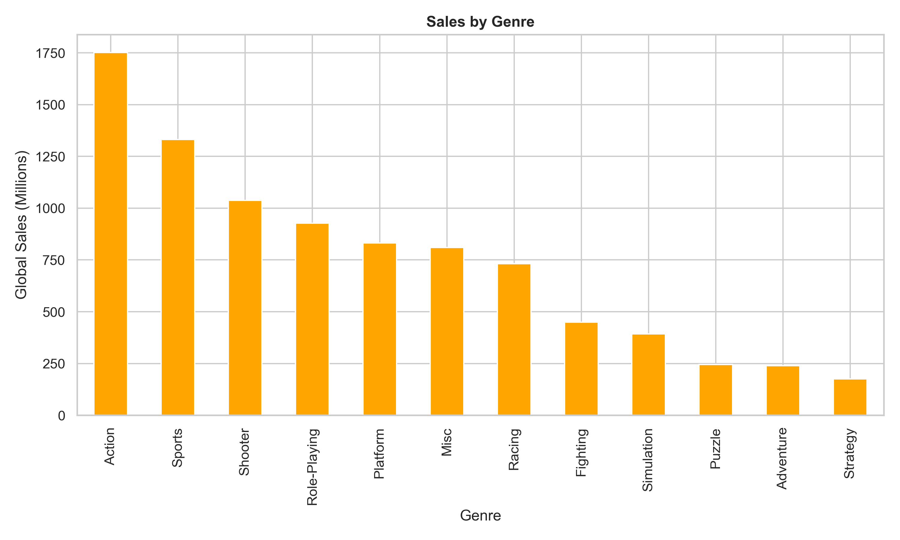
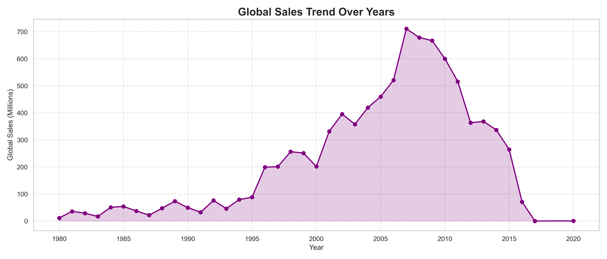
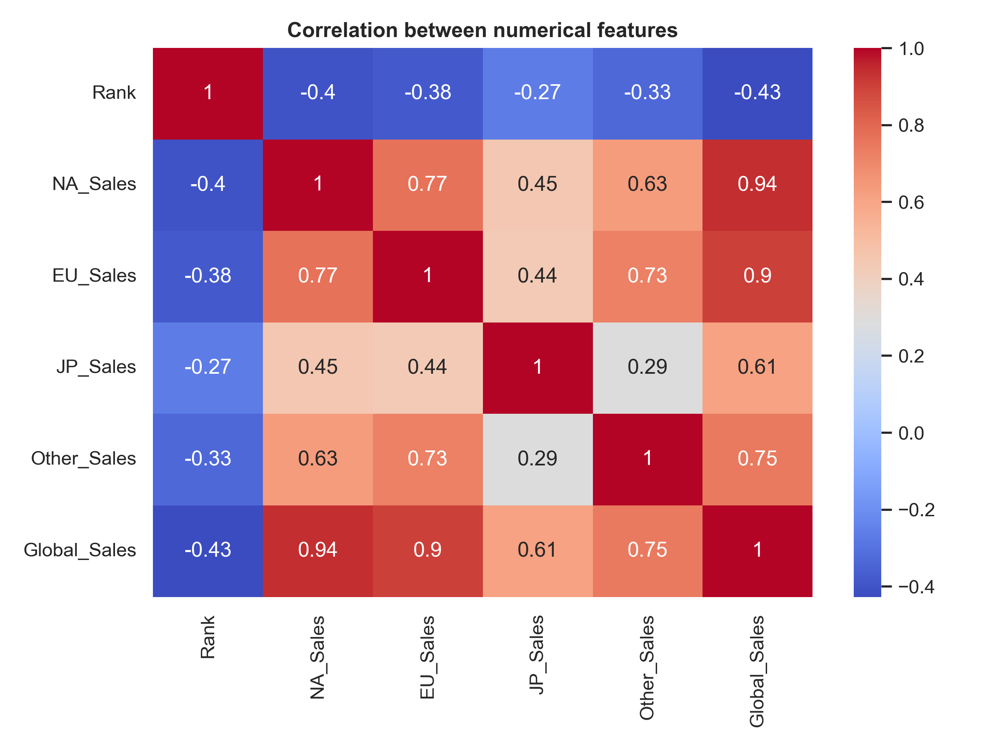
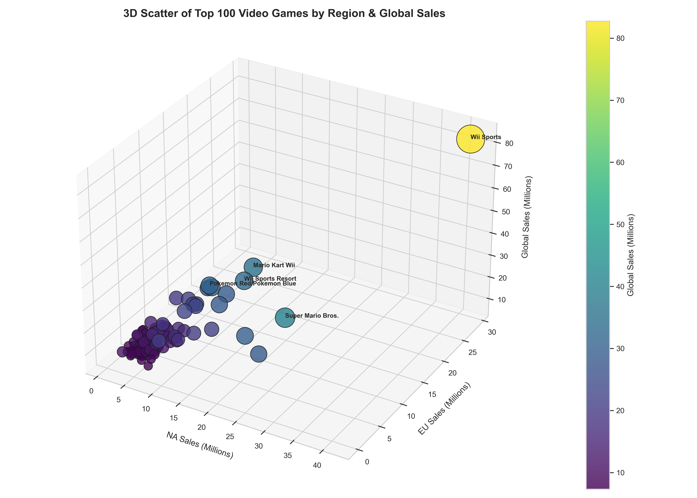

# 🎮 Video Games Sales Analysis

## Introduction
This project analyzes video game sales data to uncover trends and insights in the gaming industry. Using a dataset containing sales across multiple platforms, regions, and genres, we explore top-selling games, popular genres, sales trends over time, and correlations between sales metrics. The analysis leverages Python libraries like **Pandas**, **Matplotlib**, and **Seaborn** to create meaningful visualizations that provide a clear understanding of the market.

---

## Top 10 Best-Selling Video Games

The horizontal bar chart above shows the **top 10 video games by global sales**. It highlights how some classic titles dominate sales worldwide.

---

## Animated Top 10 Video Games (Colorful)

This colorful version of the top 10 games makes it easier to distinguish between titles and visually compare their global sales.

---

## Top 10 Game Genres by Count (Colorful)

Here we examine the **most common game genres** in the dataset. Action and Sports games lead in number of releases, reflecting market trends and developer focus.

---

## Global Sales by Genre

This bar chart shows **total global sales per genre**, indicating which types of games generate the most revenue.  

---

## Global Sales by Genre (Orange Style)

An alternate color style for genre sales that enhances readability while maintaining the same insights.

---

## Global Sales Trend Over Years

The line chart shows the **trend of global video game sales over time**, illustrating growth patterns and peak years in the industry.

---

## Correlation Between Numerical Features

This heatmap displays the **correlation between numerical sales features** (NA, EU, JP, Other, and Global Sales). It helps identify relationships between regional sales and overall performance.

---

## 3D Scatter of Top 100 Video Games by Region

The 3D scatter plot visualizes **top 100 games' sales by NA, EU, and Global regions**. Bubble size corresponds to global sales, making it easy to spot major hits.

---

## Conclusion

This analysis provides a comprehensive overview of video game sales, highlighting top performers, popular genres, regional trends, and correlations in the dataset. These insights can guide **gamers, developers, and analysts** in understanding market dynamics and making informed decisions.

---

## Tools & Libraries Used

- **Python**: Core programming language
- **Pandas**: Data manipulation and cleaning
- **Matplotlib & Seaborn**: Data visualization
- **Jupyter Notebook**: Project development and documentation

---

*Explore the visualizations above to get a clear picture of the global gaming market and discover trends that shape the industry!*
